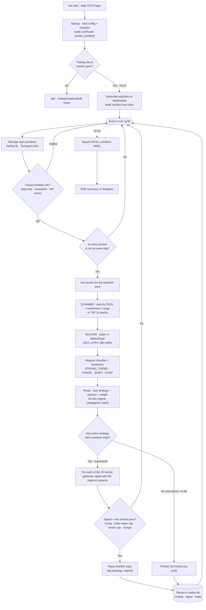
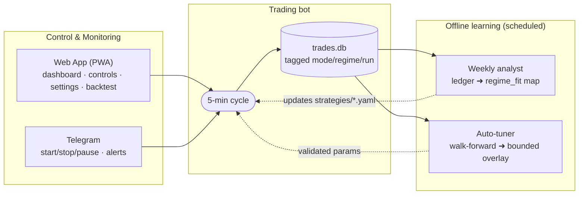

# Current Process Flow

The system **as wired today** (paper, `router_enabled: true`, scanner top-10).
Diagrams are [Mermaid](https://mermaid.js.org) — they render in VS Code / GitHub,
and Lucidchart imports them via **File → Import → Mermaid**.

## Daily lifecycle + the 5-minute intraday cycle

## Control, monitoring & the learning loops

## Legend / current state
- **Scanner** = *where* to look (top-10 stocks). **Router** = *what* to run (strategy+params by regime). Two independent axes.
- **Active today:** only **supertrend** has a seeded/validated edge, so the router runs it in **STRONG_TREND** regimes and **sits out** otherwise.
- **Not yet wired:** the **daily/positional strategies** (donchian, bb) — they showed the stronger 10-yr edge but need a separate daily sleeve. The **regime_fit map** is currently a seed; the weekly analyst replaces it with learned values as the ledger fills.
- **Discipline:** unvalidated params never trade live/paper; premarket sets the risk ceiling, intraday can only lower it; every decision is persisted and auditable.
